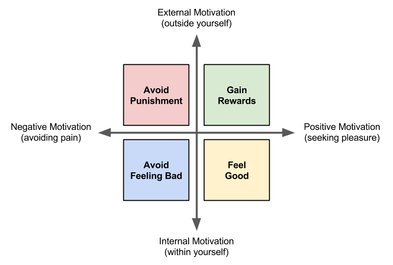
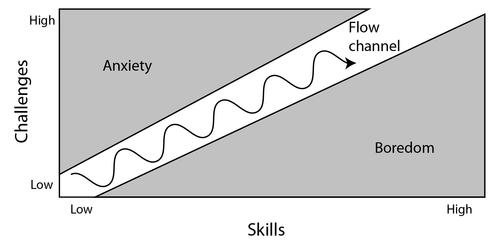

# 1.2 Incentives and Flow



We know that video game players are motivated by different types of gameplay. For example, some players are motivated to play games featuring destruction and competition, some players are motivated by games featuring story and strategy, etc.

Besides the type of gameplay, there are other factors that can keep players motivated and engaged in a game. We can use research findings from psychology to understand factors that motivate people to perform certain behaviors \(whether playing a game, doing a task, learning something, etc.\).

Two of the possible ways to classify motivations include:

* **External vs. Internal** — External motivations originate outside ourselves, while internal motivations come from within ourselves.
* **Negative vs. Positive** — Negative motivations involve painful experiences, while positive motivations involve pleasing experiences.

This model represents these two dimensions for classifying motivations:

This model classifies motivations into four types:

* Negative External Motivation \(punishments\)
* Positive External Motivation \(rewards\)
* Negative Internal Motivation \(feeling bad\)
* Positive Internal Motivation \(feeling good\)

Video game designers typically use all four of these types of motivations to help keep players engaged in the gameplay through **incentives** and **flow**.

## External Motivation:  Incentives

**Incentives**, such as rewards and punishments, can be very effective at getting people to do certain things. However, the effectiveness depends on the amount and frequency of the rewards or punishments. Psychologist B.F. Skinner conducted numerous [studies on the effectiveness of external motivations on behavior](https://www.simplypsychology.org/operant-conditioning.html).

Rewards and punishments are commonly used in video games to help players learn how the gameplay works and to keep players engaged in the gameplay:

* **Rewards** in games might include:  receiving points, gaining special abilities, etc.
* **Punishments** in games might include:  losing health, losing resources, etc.

An advantage of incentives is they can quickly teach and reinforce desired behaviors. Typically, people will quickly learn the cause-and-effect relationship between their actions and the incentives that result.

However, a disadvantage of incentives is that people will also quickly **stop** performing a behavior if the rewards or punishments are removed — unless the person has developed some internal motivation to keep performing the behavior.

## Internal Motivation: Flow

People will naturally do certain things to **avoid pain** \(e.g., to avoid pain, fear, anxiety, embarrassment, unhappiness, etc.\) and **seek pleasure** \(e.g., to feel happy, satisfied, engaged, empowered, etc.\). This internal motivation helps us fulfill basic biological, psychological, and social needs. In general, internal motivation is more effective than external motivation at determining people's behavior.

Psychologist Mihály Csíkszentmihályi conducted research on happiness, creativity, and motivation in people. He found that people performing tasks can experience a mental state of deep focus and engagement that he called **flow**. This is sometimes referred to this as "being in the zone" \(which is the opposite of "zoning out"\).

If you're experiencing flow while performing a task:

* You are completely focused on the task \(e.g., might forget to eat or rest, etc.\).
* You have a feeling of control \(e.g., feel confident, know what to do next, etc.\).
* You aren't thinking about yourself \(e.g., your worries melt away, etc.\).
* You lose awareness of time \(i.e., usually time will seem to fly by\).
* You enjoy doing the task for its own sake \(i.e., positive internal motivation\).

People can experience flow in many different types of tasks, including:  art, music, sports, games, work, hobbies, etc. Experiencing flow requires certain conditions:

* Having clear goals
* Avoiding distractions
* Receiving clear, immediate feedback
* Having proper balance of challenges vs. skills

The challenge of a task plays a critical role in whether or not the person experiences flow. This diagram shows how flow is affected by the challenge of a task compared to the person's skill level:

The diagram reveals several things about challenges vs. skills:

* If the challenge of a task is **too high** compared to your current skill level, it leads to anxiety \(feeling bad\) — and you'll probably stop doing the task.
* If the challenge of a task is **too low** compared to your current skill level, it leads to boredom \(feeling bad\) — and you'll probably stop doing the task.
* If the challenge of a task is **well-matched** to your current skill level, it leads to a sense of focus and control \(feeling good\) — and you'll probably stay engaged in the task. You're probably in a state of flow.
* As you continue to perform a task, your skills tend to increase over time, so the challenges also need to increase at an appropriate rate to keep you in flow \(and prevent you from becoming anxious or bored\).

Many video games are designed to include the right conditions to encourage a state of flow — such as clear objectives, clear feedback, balancing the game's challenges vs. the player's skills, etc. Including these conditions in your game will typically improve the gameplay experience, even if the player doesn't experience flow.

## Assignment

1. Read the information above on external and internal motivations. If necessary, discuss these concepts within your team or as a class. For example, how have you experienced incentives and flow in other tasks besides video games?
2. Follow the instructions and links in this [assignment template](https://drive.google.com/open?id=1DKCLOFFGj_s4OznDyzhbZ9bZlf04L7SZI3MNtQO-QRI) to playtest two video games to compare their use of incentives and flow to motivate players.
3. Discuss your findings from the video game comparisons as a class.


**MAKE A COPY:**  To use a template, be sure you're logged in to your Google Account. From the template's **File** menu, select **Make a copy**. Save the copy to a folder in your Google Drive. You can now modify it.


### **❏ Deliverable**

Submit your analysis of incentives and flow in the video games



| **✓- Below Standard** | **✓ Meets Standard** | **✓+ Exceeds Standard** |
| :--- | :--- | :--- |
| Description | Description | Description |



