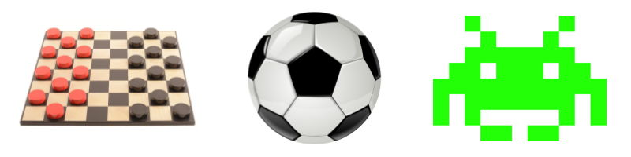
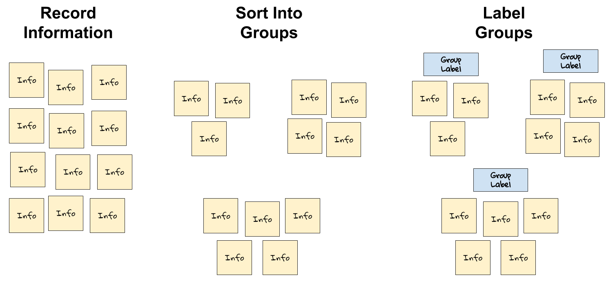
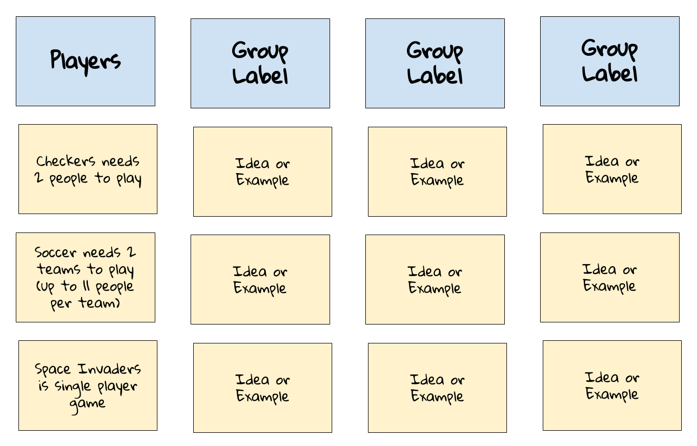

# 1.3 Game Design Elements

Games have certain design elements that help define them as being games — whether it is a board game, a card game, a sport, a video game, etc. If you're going to create a game, you'll need to make design decisions about all the key elements of your game.

For example, we recognize checkers, soccer, and Space Invaders as being examples of games. What do these have in common that define them as being a game?

We would probably agree that one element that all games have is **players** — people that agree to participate in the game. Checkers needs two players. Soccer needs two teams of players. Space Invaders is a single-player game. Every game has one or more players as part of its design.

Game designers have come up with different ways to define the elements of games. In this assignment, you will come up with a set of game design elements by constructing an **affinity diagram**.

An [affinity diagram](https://uxdict.io/design-thinking-methods-affinity-diagrams-357bd8671ad4) takes a large set of information \(such as ideas, examples, notes, etc.\) and sorts it into a smaller set of groups that reveal patterns and relationships.

Constructing an affinity diagram involves three basic steps:

1. **Record each piece of information separately**. If possible, record the information on index cards or sticky notes \(to make it easier to sort the ideas into groups and label the groups\). Otherwise, record the information as a list in a document.
2. **Sort related pieces of information into groups**. You can have as many groups — or as few groups — as you need, based on the patterns in the information. The groups will not necessarily have the same number of pieces of information.
3. **Label each group to identify the pattern or relationship it represents**. Add the group's label using a new card or note — or add the label to your document.

## Assignment

1. Work in a small team \(2-4 people\) to construct an affinity diagram of the elements that define games. It might help to focus on a small number of specific games \(such as:  checkers, soccer, Space Invaders, etc.\). What are the specific elements that define each game? Record your examples, sort them into groups, and label the groups. When finished, take a photo of your affinity diagram \(if you used cards or notes\) — or save a copy of your document.
2. Discuss your findings as a class. How similar are they?
3. Compare your class findings to this [reference list of game design elements](https://drive.google.com/open?id=1bUkdyClNAGLFySKMruNOeGyqbKr3Byjk). How similar are the class findings to these game design elements?
4. Use the reference list to analyze the design elements of an existing game by completing [this assignment template](https://drive.google.com/open?id=1K67FfiGbvtP5YMASqr2rnMXd1LKlR31lT6IiVBMhK-o). This could be an individual assignment or team assignment, based on your teacher's direction.

### Affinity Diagram

Your completed affinity diagram will be a document or photo showing related information \(ideas, examples, etc.\) sorted into groups that are labeled. This example affinity diagram includes a group labeled "Players" with examples from specific games. The other three groups in the diagram don't list specific labels or information \(but your diagram should\).  Your diagram will probably have more than 4 groups. The groups will not necessarily have the same number of pieces of information in them.

### Analysis of Design Elements in Game

Here is an [example analysis of the game design elements in Space Invaders](https://drive.google.com/open?id=1D_0ZdLoE6JDqm-rKZH79UGnvxLs6O0SZ)

