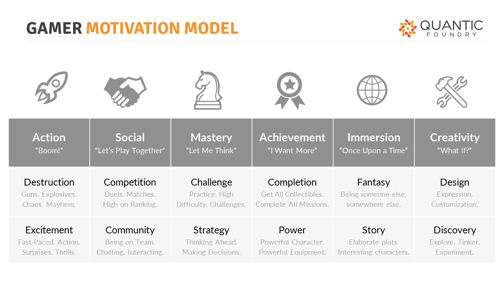

# 1.5 Target Player Persona

Based on the research you completed in the previous assignments, your project team is ready to begin creating its own video game by following a player-centered design process. You'll start by deciding:

* What kind of gameplay experience do you want to design?
* Who are the target players you're designing this game for?

The first step is to **select gaming motivations to target** for the gameplay experience. Most games target more than one gaming motivation, often from different motivation groups. This can allow the gameplay to be more complex and appeal to more players.

You'll use Quantic Foundry's Gamer Motivation Model, which identifies 12 different gaming motivations that form into 6 motivation groups \(Action, Social, Mastery, Achievement, Immersion, and Creativity\).

For example, a team might decide to target the gaming motivations of Excitement, Strategy, and Story \(which are from the groups of Action, Mastery, and Immersion\).

Next, your team will **create player experience goals** based on your targeted gaming motivations. Player experience goals describe what players will do, think, or feel during your gameplay.

Player experience goals will help narrow your focus for brainstorming game ideas, while still being general enough to allow a range of possible game design features.

For example, some possible player experience goals for a game targeting Excitement, Strategy, and Story might be:

* Players will have to make quick decisions weighing risk vs. reward.
* Players will feel a sense of tension during the gameplay.

Finally, your team will use its targeted gaming motivations and player experience goals to **create a persona representing a possible target player** for your game.

A persona is a model of a target user for a product or service, such as an app, website, device, etc. The persona summarizes the target user’s background, motivations, goals, needs, and expectations. The persona is used as a reference throughout the design process to help ensure your solution meets the needs of your target users.

Normally, a persona is based on user research data gathered through interviews, surveys, observations, etc. However, in this case, you'll create a fictional \(yet realistic\) persona based on your targeted gaming motivations and player experience goals.

## Assignment

1. **Select 2-4 gaming motivations to target for the game your team will design.**
   * Be sure each team member has one of their top three gaming motivations represented \(refer to your Gamer Motivation Profile results\).
   * Be sure to select motivations from at least 2 different motivation groups.
2. **Create 1-3 player experience goals to target for your team's game design.**
   * Be sure each goal relates to one or more targeted gaming motivations.
   * Be sure each goal will allow a range of possible game design ideas.
3. **Use** [**this template**](https://drive.google.com/open?id=1kc1Bu4eh5CwHrWh8ZsVuVoaxdg1TMjsfFsVbA0VNMC4) **to create a persona representing a target player.**
   * List your team's targeted gaming motivations and player experience goal\(s\).
   * Complete the persona by adding a photo, name, and other relevant characteristics consistent with your target player audience.
   * The persona should seem realistic — not a joke or stereotype.
   * Your team will be designing its game to appeal to this persona.

