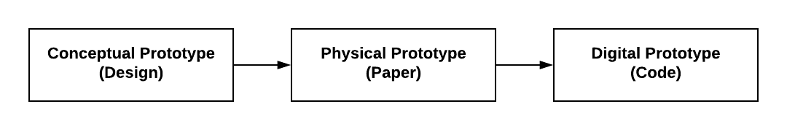

# 2.2 Game Design Document



Your team will create a **game design document**, which details your game's design and will help guide the prototyping and development of your game.

A game design document builds upon a game treatment by adding specifics for all the [game's design elements](https://drive.google.com/open?id=1bUkdyClNAGLFySKMruNOeGyqbKr3Byjk):

* **Structural Elements** — which determine the game's mechanics
* **Dramatic Elements** — which determine the game's story
* **Artistic Elements** — which determine the game's aesthetics

The game design document also includes concept sketches of the game world, characters, and key game objects.

The game design document is a "conceptual prototype" of your game's design. Later, your team will construct and test a physical prototype of your game \(using paper\) before developing your digital prototype \(using code\).

1. Use [this template](https://drive.google.com/open?id=1u7UC1w3y59I1qJS-AW6A3rn0QKfu6Evh_QtdEFUDG_8) for your team's game design document.
   * **Summary of Game Concept:**  Transfer this from your game treatment. You can make revisions based on the feedback from your proposal presentation.
   * **Gaming Motivations and Player Experience Goals:**  Transfer these from your target player persona.
2. Document your game's design elements by brainstorming, discussing, and refining ideas as a team.
   * **Dramatic Elements:**  Transfer the premise, characters, and story from your game summary. Then add more details \(as necessary\) for these elements, as well as the other dramatic elements \(such as challenge, etc.\).
   * **Structural Elements:**  Transfer the objectives and conflict from your game summary. Then add more details \(as necessary\) for these elements, as well as the other structural elements of your game \(such as procedures, etc.\).
   * **Artistic Elements:**  Transfer the concept sketches from your game treatment. As necessary, revise the sketches or add more. Then add details for the other artistic elements of your game \(such as audio, etc.\).
3. Review your completed game design document to ensure the design elements form a cohesive game matching the targeted gaming motivations and player experience goals.
   * It may be helpful to have someone outside your team also review the game design document to provide feedback.
   * Refine your game's design elements as necessary.

### **❏ Deliverable**

Submit your team's game design document \(including concept sketches\)



example of deliverable



| **✓- Below Standard** | **✓ Meets Standard** | **✓+ Exceeds Standard** |
| :--- | :--- | :--- |
| Description | Description | Description |



