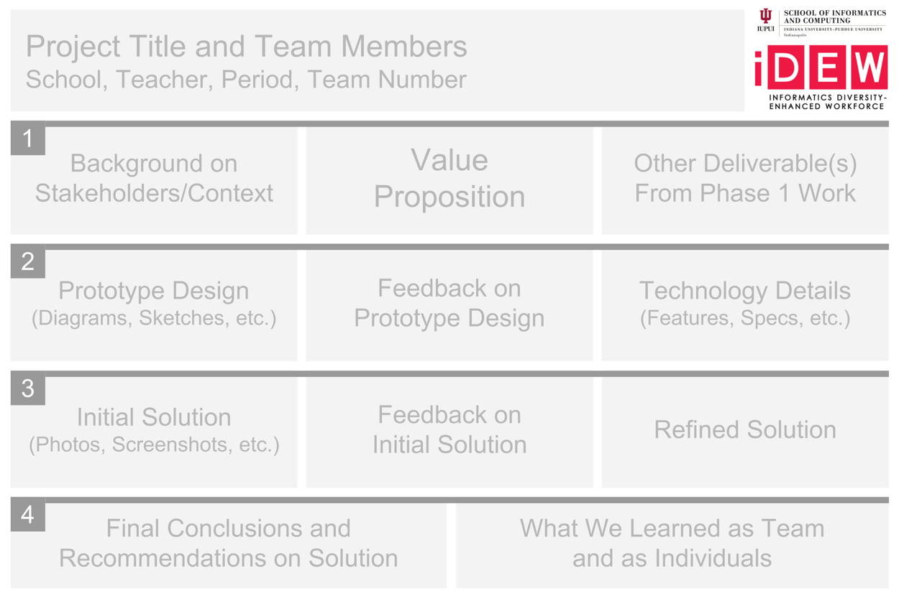

# 3.3 Project Poster



You'll create a **poster** that helps explain and show how your team researched, designed, prototyped, and evaluated your team's video game.

The poster will be a visual reference to supplement the explanation and demonstration that your team gives during the public presentation event. Even though a poster won't explain or show everything about your team's project, a person should be able to understand the key aspects of your team's project just by reviewing your poster.

The goal is for the poster to be clear, concise, engaging, and professional in terms of its content and visual design.

The standard size for a large poster is 36 inches wide by 24 inches tall \(your teacher will clarify if a different poster size will be used\). Print-quality materials typically use a resolution of 300 pixels per inch. Your teacher will have the posters printed prior to the public presentation.

1. **Determine the content to be included on the poster.** Gather text and images from your team's previous project deliverables. You may need to modify certain content to make it more suitable for a poster \(e.g., text might need to be summarized or simplified, images might require labels or captions, etc.\).
2. **Determine the layout of the content** by sketching a small-scale poster mockup on a regular sheet of paper. Be sure the layout will be easy to understand and follow.
3. **Create a full-scale digital version of the poster** using a drawing/illustration tool, such as Google Drawing, Pixlr Editor, Adobe Illustrator, etc. Be sure the visual design of the poster reinforces the concept behind your team's robot solution.
4. **Save or download the final poster as a PDF file** that your teacher will have printed.

### POSTER TEMPLATE

* You can use this [Google Drawing template](https://drive.google.com/open?id=1L81WNIn5YMEQ9TlcliLTdiCO-KwnzWIsXBGnqdumzzo) which is set to 36 inches wide by 24 inches tall. Zoom in or out as needed to add text, images, etc. – but do **not** change the canvas size. \(To use the template, make a copy from the File menu, and save the copy to your shared team folder in Google Drive.\)
* If you use a different drawing/illustration tool, set the canvas to 36 inches wide by 24 inches tall at 300 pixels per inch \(10800 pixels wide by 7200 pixels tall\).
* If your teacher has specified a different size for the poster, use that instead.

## **❏ Deliverable**

Submit a PDF of your team's poster for printing



This shows a generic layout for the typical content that would be included in a project poster. However, you can modify the layout and appearance as necessary.




| **✓- Below Standard** | **✓ Meets Standard** | **✓+ Exceeds Standard** |
| :--- | :--- | :--- |
| Description | Description | Description |



